Gqrx Enhanced
=============

This is an enhanced fork of [Gqrx](https://gqrx.dk/), an open source software defined radio (SDR) receiver. It adds multi-receiver support, improved IQ recording, RadioReference.com integration, and many UI enhancements.

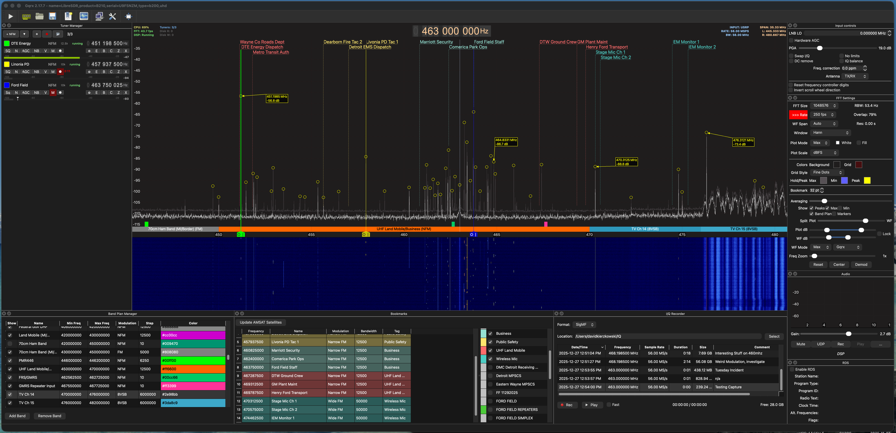
*Full interface with multiple tuners, color-coded bookmarks, pinned peak labels, and band plan overlay*


New Features
------------

This fork combines several feature branches to create an enhanced GQRX experience.

### Multi-Receiver Support

Monitor multiple frequencies at once with independent receivers.

- **Multiple Tuners**: Add multiple receiver channels, each with its own frequency, mode, and filter settings
- **Tuner List Panel**: Manage all your tuners in a dedicated dock widget
- **Visual Markers**: Each tuner shows on the FFT with color-coded frequency markers
- **Drag to Tune**: Click and drag tuner markers to change frequency
- **Filter Resizing**: Drag filter edges to adjust bandwidth
- **Wheel Fine-Tuning**: Mouse wheel over a tuner marker for precise adjustment
- **Double-Click Recenter**: Double-click anywhere on the FFT to recenter the SDR
- **Per-Tuner Recording**: Record IQ and audio independently for each tuner with flexible capture modes

**Per-Channel Recording Modes:**
| Mode | Description |
|------|-------------|
| Constant | Record continuously to a single file |
| Per Call (Squelch) | Create a new file each time squelch opens - perfect for logging individual transmissions |
| Condensed (Squelch Chunks) | Time-based file segments that only contain audio when squelch is open - removes dead air automatically |

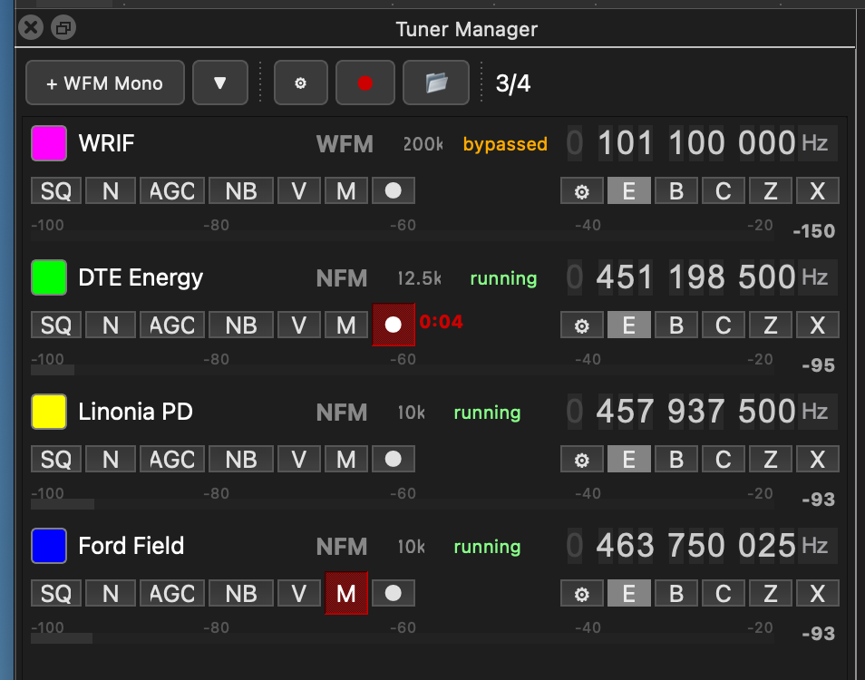

*Tuner Manager showing four tuners with independent frequency, mode, and recording controls*

**Toolbar buttons:**
| Button | Function |
|--------|----------|
| + | Add new tuner at current frequency |
| ▼ | Select demodulation mode for new tuners (WFM, NFM, AM, USB, LSB, CW) |
| ⚙ | Open tuner manager settings |
| ● | Record all tuners simultaneously |
| 📁 | Open recordings folder |
| 3/4 | Current tuner / total count |

**Per-tuner controls:**
| Button | Function |
|--------|----------|
| SQ | Toggle squelch |
| N | Noise blanker 1 |
| AGC | Automatic gain control |
| NB | Noise blanker 2 |
| V | Volume slider |
| M | Mute audio output |
| ● | Record this tuner (shows elapsed time) |
| O | Toggle audio output |
| E | Edit tuner name |
| B | Bookmark this tuner frequency |
| C | Center FFT on this tuner |
| Z | Cycle through zoom levels |
| X | Delete tuner |

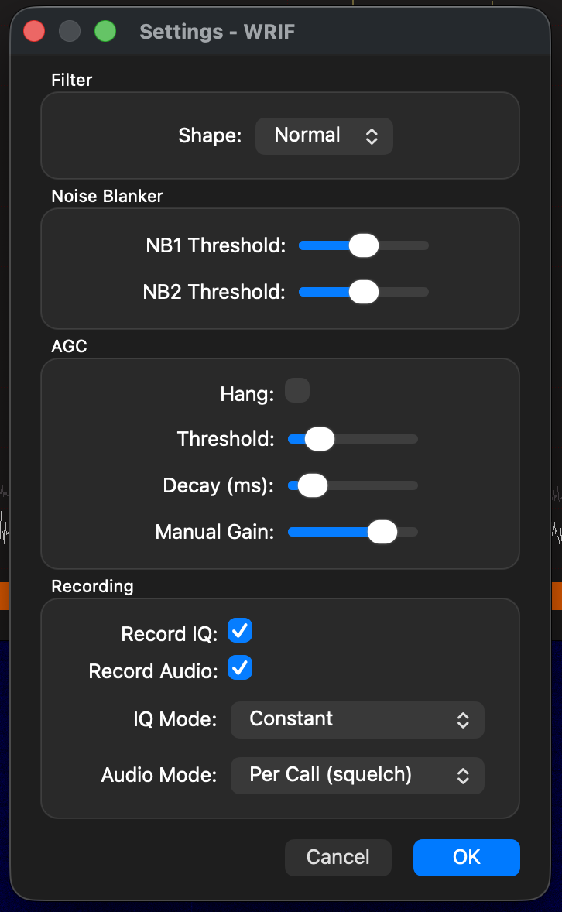

*Per-tuner settings for filter shape, noise blanker, AGC, and recording options*

### Enhanced IQ Recorder

A completely redesigned IQ recording and playback system.

- **Table View**: Sortable columns showing filename, date, frequency, sample rate, duration, size, and comments
- **SigMF Format**: Uses SigMF metadata by default for proper recording documentation
- **File Comments**: Add notes to your recordings via SigMF or JSON sidecar files
- **Right-Click Menu**: Show in Finder, edit comments, delete files
- **Column Visibility**: Choose which columns to display via header right-click
- **Disk Space Indicator**: See available recording space at a glance
- **Filename Templates**: Customizable filename patterns with date, frequency, and channel variables

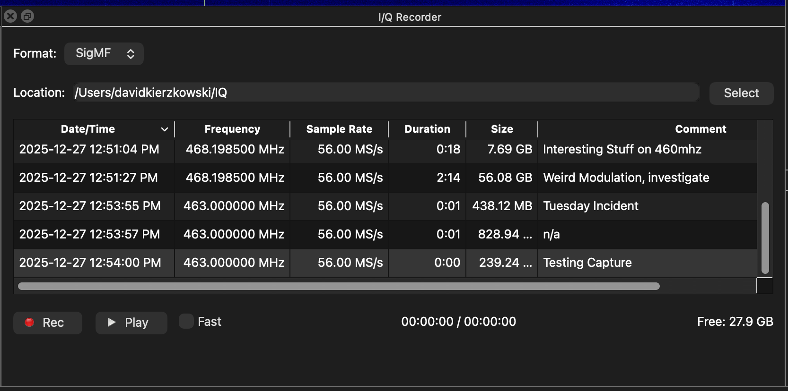
*IQ Recorder with sortable table view, file comments, and SigMF format support*

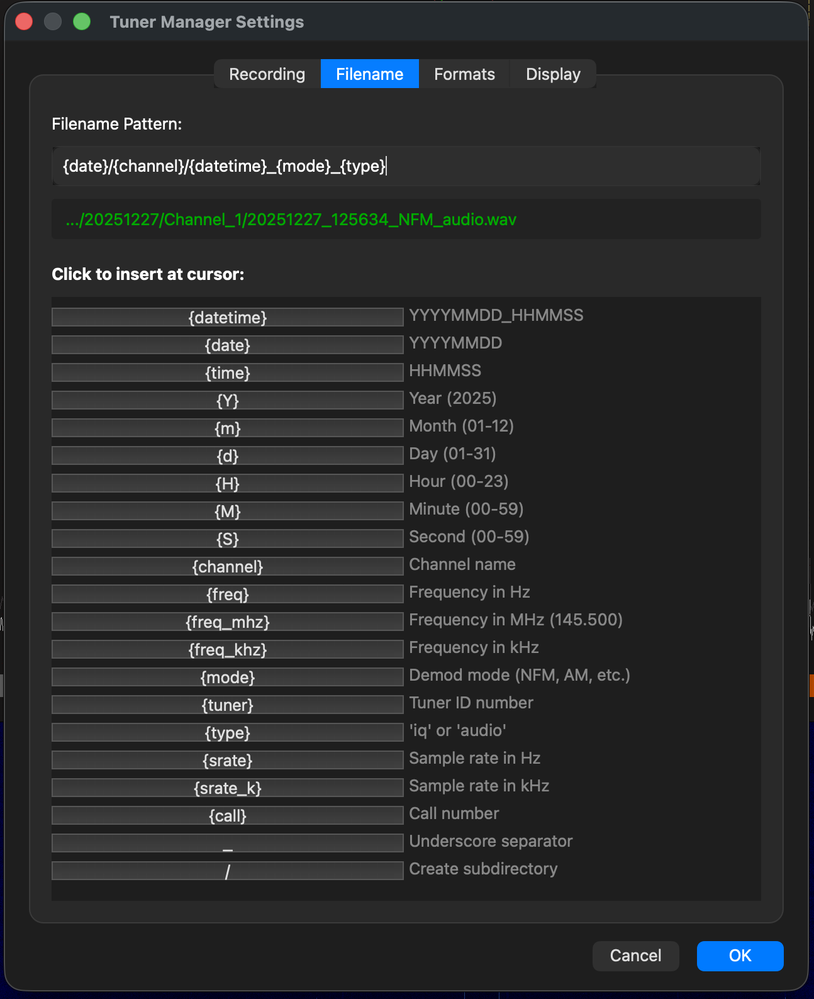

*Customizable filename patterns with live preview*

### RadioReference.com Integration

Import conventional frequencies directly from RadioReference.com's database.

- **Location-Based Search**: Select state, county, or metro area to find local frequencies
- **Category Filtering**: Filter results by Police, Fire, EMS, Business, etc.
- **Bulk Import**: Select multiple frequencies to import as bookmarks

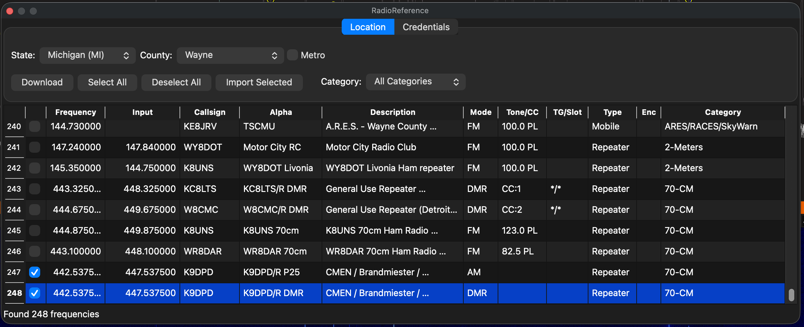
*Import frequencies from RadioReference.com by location and category*

### FCC Broadcast Station Import

Import FM radio and TV broadcast stations from the FCC database.

- **Location-Based Search**: Uses device GPS or IP geolocation to find your location
- **Radius Filter**: Configurable search radius in miles
- **FM & TV Stations**: Import both FM radio stations and TV broadcast frequencies
- **Auto-Tagging**: Stations are automatically tagged as "FM Stations" or "TV Stations"

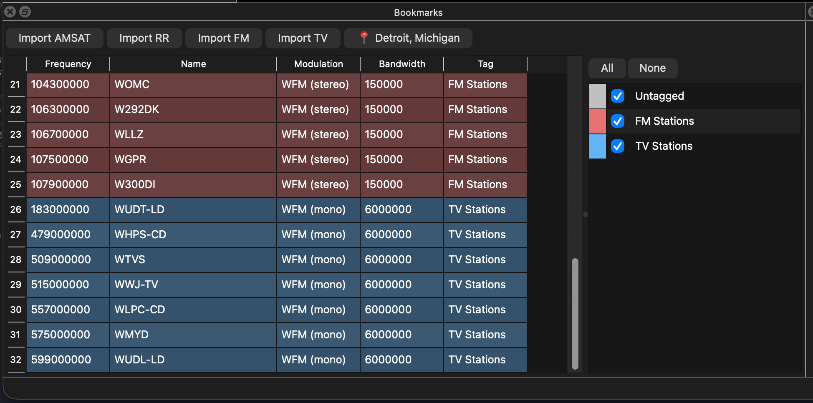

*FCC broadcast import showing Detroit area FM and TV stations*

### FFT Display Enhancements

Customizable FFT display with new annotation features.

- **Color Customization**: Change colors for background, grid, max hold, min hold, and peak indicators
- **Grid Styles**: Choose between dotted, dashed, or solid grid lines
- **Bookmark Font Size**: Adjust the size of bookmark labels
- **Pinned Peak Labels**: Double-click on peaks to add persistent labels showing frequency and dB
- **Draggable Labels**: Move pinned labels anywhere on the display
- **Smart Arrows**: Leader lines with arrowheads track peak positions
- **Bookmark Snapping**: Peak labels snap to nearby bookmark frequencies for accuracy
- **Floating Bookmark Lines**: Bookmark lines float above the FFT signal instead of running to the bottom
- **Bookmark Clustering**: When bookmarks are close together, they automatically group into a numbered balloon
- **Click-to-Expand Fan**: Click a cluster balloon to expand bookmarks in a fan pattern for easy selection

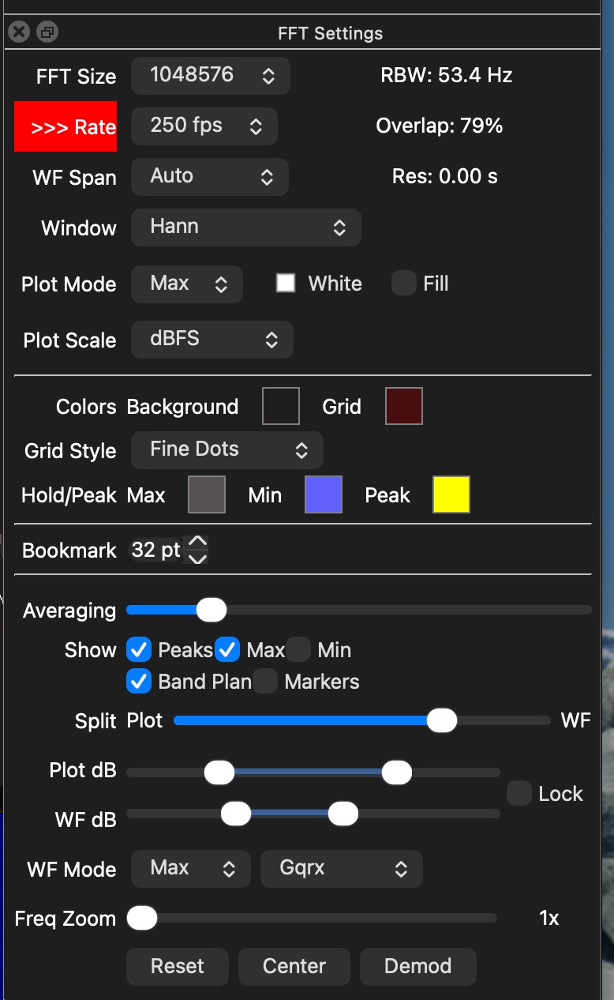

*FFT customization options for colors, grid style, and peak detection*

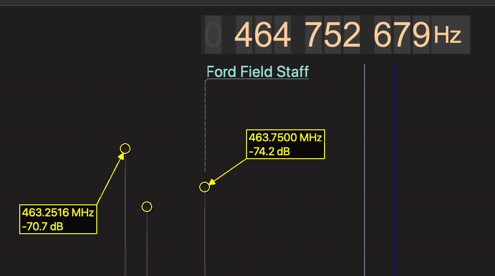
*Pinned peak labels with bookmark snapping and leader line arrows*

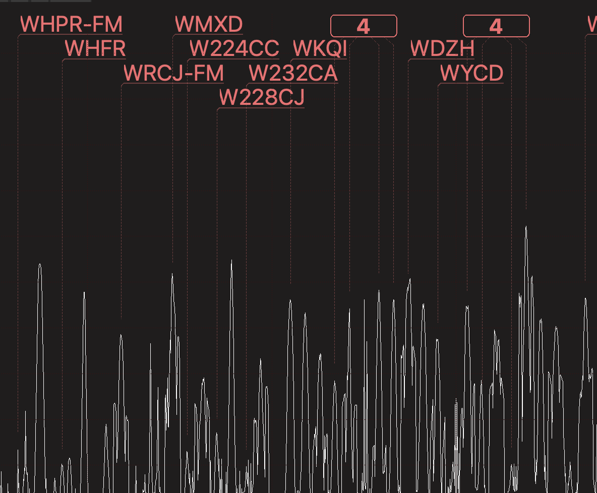

*Clustered bookmarks show as numbered balloons - click to expand*

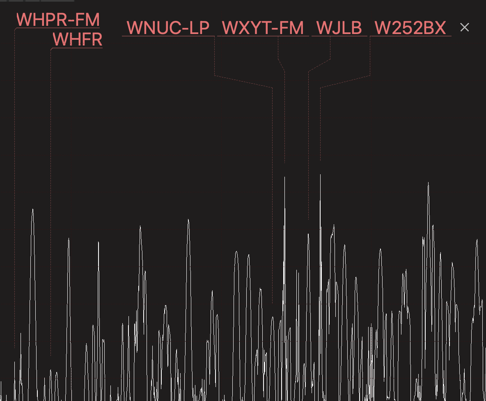

*Expanded cluster showing individual bookmarks in a fan pattern*

### Band Plan Manager

Interactive band plan display and management.

- **Visual Band Overlay**: See band allocations directly on the FFT display
- **Band Plan Dock**: Browse and manage band plans in a dedicated panel
- **Click to Tune**: Click on a band to tune to that frequency range
- **Customizable Plans**: Edit band plans via CSV configuration

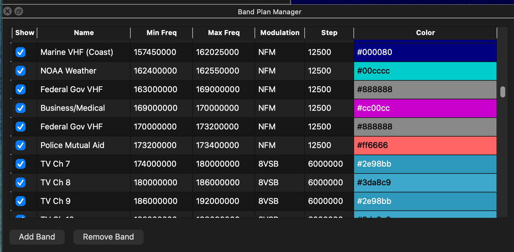
*Band Plan Manager dock for browsing and editing frequency allocations*

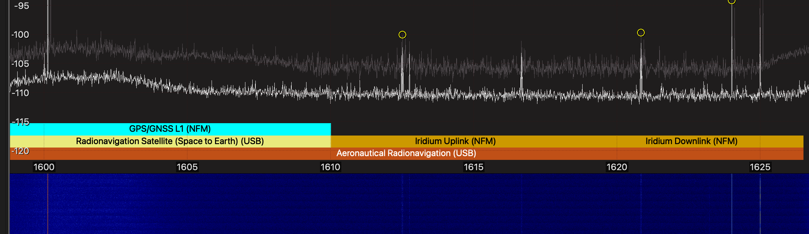
*Band allocations displayed as colored overlays on the FFT display*


Building from Source
--------------------

```bash
mkdir -p build && cd build
cmake ..
make -j$(nproc)
```

### Dependencies

Same as upstream Gqrx:
- GNU Radio 3.8, 3.9, or 3.10
- Qt 5 or Qt 6
- gr-osmosdr (optional, for hardware support)
- cmake >= 3.5.0


Branch Structure
----------------

| Branch | Description |
|--------|-------------|
| `master` | Synced with upstream gqrx |
| `feature/combined` | All features merged together |
| `feature/IqTool-Enhanced` | Enhanced IQ recorder |
| `feature/BookmarkManager-Enhanced` | RadioReference integration |
| `feature/FFT-Enhanced` | FFT colors and pinned peaks |
| `feature/BandplanManager-Enhanced` | Band plan dock widget |
| `feature/MultiRx` | Multi-receiver support |


Contributing
------------

I'm open to contributing these features upstream to the main Gqrx project. However, in their current state, these features would need more thorough code review, testing across different platforms and hardware, and potentially some refactoring to meet upstream standards. For now, this fork serves as a testing ground for new ideas and may be better suited as a standalone project.

Bug reports and feature requests are welcome via GitHub Issues.

You can also reach me on the [trunk-recorder Discord](https://discord.gg/trunk-recorder) as **dave023593** (Dave - K9DPD).


Credits
-------

This enhanced version builds upon the excellent work of Alexandru Csete OZ9AEC and all the Gqrx contributors.

Enhancements by David Kierzkowski K9DPD.

Gqrx is licensed under the GNU General Public License.
